# Skill-Wave Service Hiring Web Application

The Skill-Wave Service Hiring Application is a web app designed to assist individuals in finding and hiring various service providers when they are in unfamiliar locations. This application offers a wide range of services, including doctors, mechanics, plumbers, and many more. It leverages real-time location data to provide users with suggestions for service providers based on their current location, making it easy for users to find the help they need quickly and efficiently. The frontend of the application was developed using HTML, CSS, Tailwind CSS, JavaScript, and jQuery, ensuring a user-friendly and responsive interface. The backend is powered by PHP (PDO) and MySQL, which manage the server-side operations and data storage. This project was undertaken as part of a final year project for a Software Engineering degree, showcasing practical implementation of location-based services to enhance user experience.

## Functions of the Project

- Admin, User (Service Seekers, Providers) Account creation.
- Admin can manage the process.
- Service Provider's account verification by Admin.
- Location-based Services (Google API).
- Email Sending Feature.
- Mobile Responsive design.
- Payment method through Stripe API.
- Status based service-provider filterization.
- Location based service-provider suggestion.
- Feedback providing implementation. (Service-seeker to Service-provider)

## Technologies and Libraries Used and Learned

| S.No | Technologies and Libraries Used                                                                   |
| :--- | ------------------------------------------------------------------------------------------------- |
| 01   | [HTML](https://www.w3schools.com/html/)                                                           |
| 02   | [CSS3](https://www.w3schools.com/css/)                                                            |
| 03   | [TailwindCSS](https://tailwindcss.com)                                                            |
| 04   | [JavaScript](https://www.youtube.com/watch?v=OuUqS8Po5ps&list=PL73Obo20O_7ihsIM5K-hHYPrcqkkdQcLa) |
| 05   | [PHP - PDO](https://www.youtube.com/playlist?list=PL6u82dzQtlfvfEgHdRvh4l2lqdVlQOa5x)             |
| 06   | [JQuery](https://www.youtube.com/playlist?list=PL6u82dzQtlfvfEgHdRvh4l2lqdVlQOa5x)                |
| 06   | [MySQL](https://www.youtube.com/playlist?list=PL6u82dzQtlfvfEgHdRvh4l2lqdVlQOa5x)                 |
| 07   | [JustValidateDev (Data Validation)](https://just-validate.dev)                                    |
| 08   | [Google Maps API](https://developers.google.com/maps/documentation/javascript/overview)           |
| 09   | [Stripe API](https://stripe.com/docs/api)                                                         |
| 10   | [PHPMailer](https://github.com/PHPMailer/PHPMailer)                                               |
| :--- | -------------------------------------                                                             |

## Screenshots


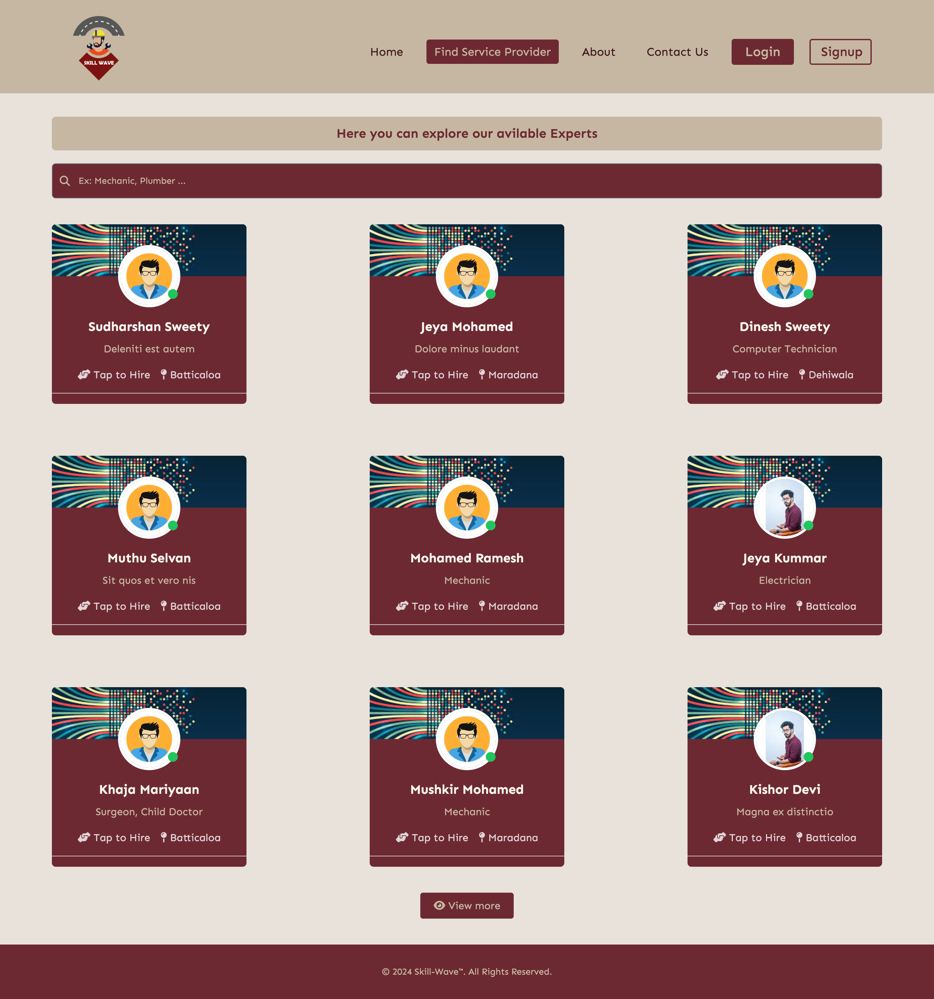

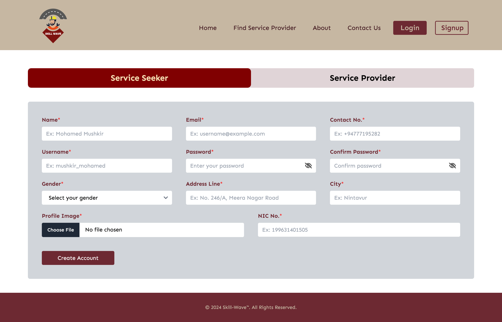

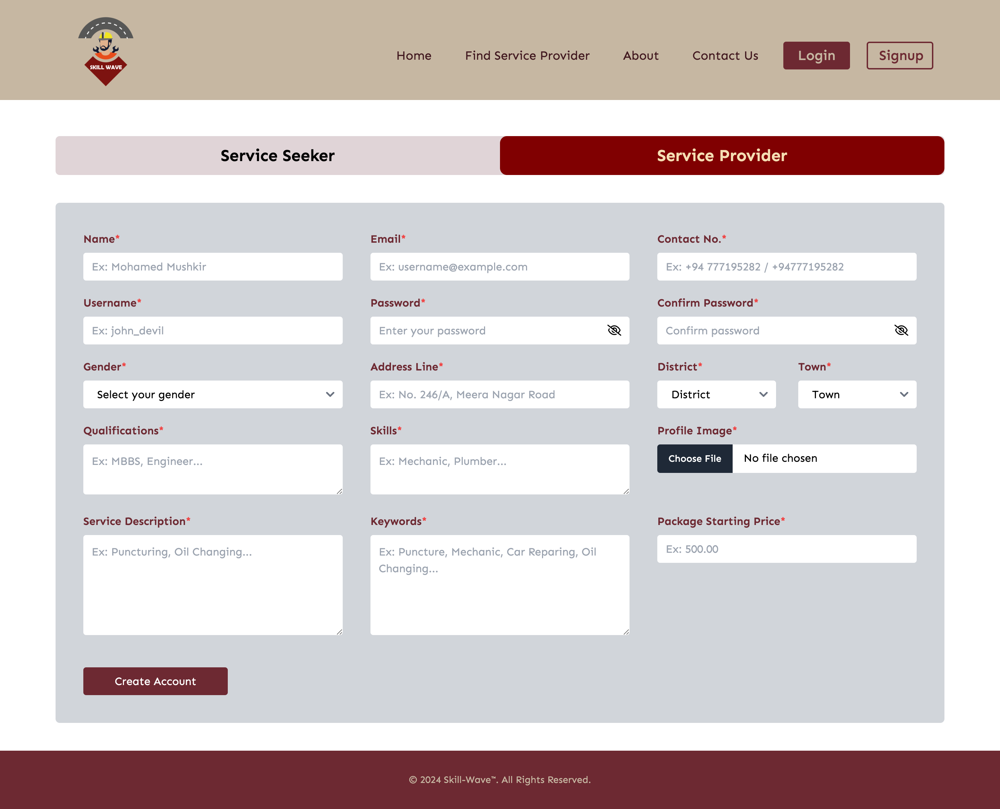

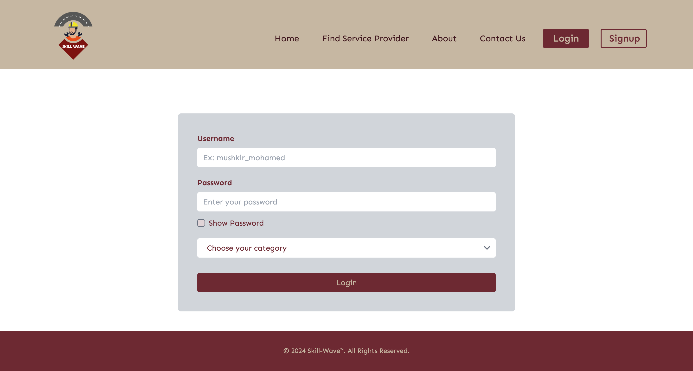

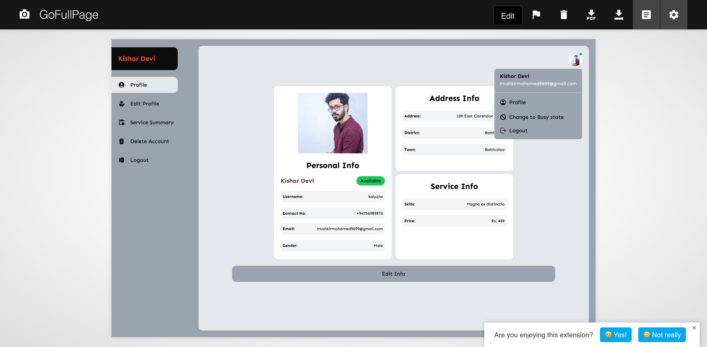

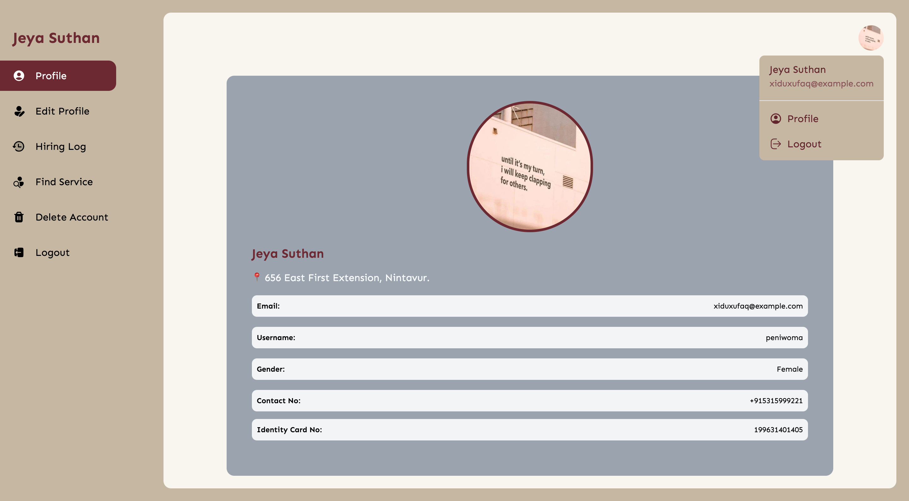

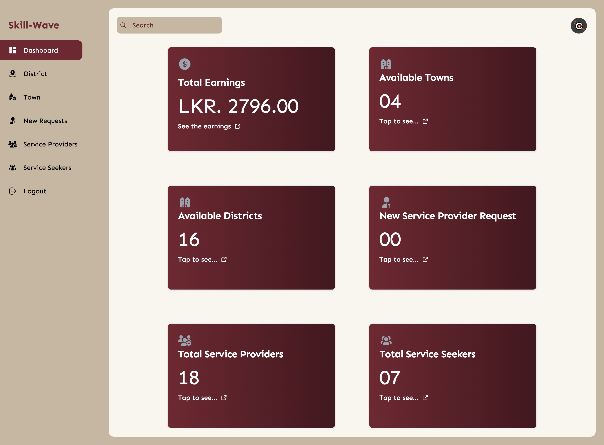

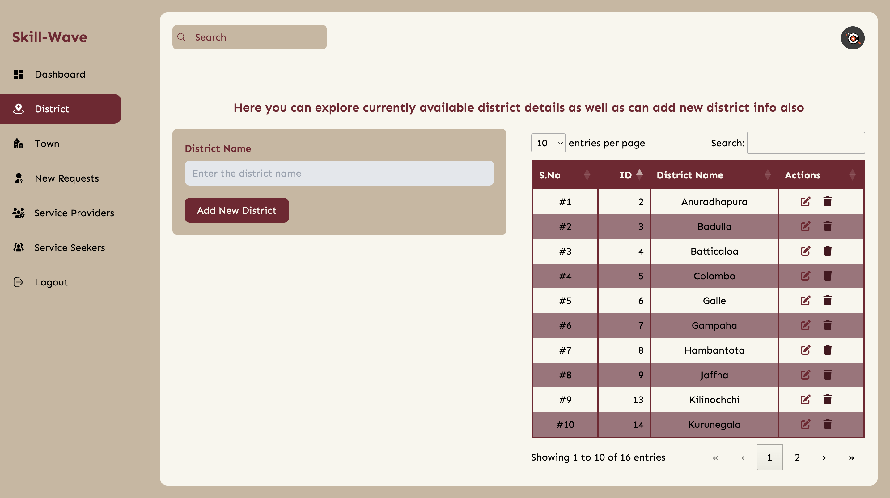

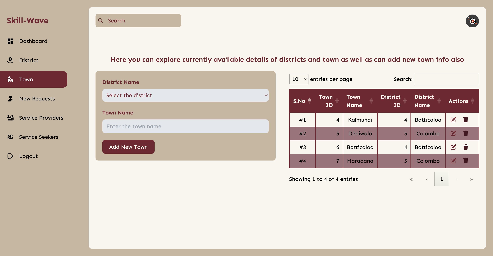

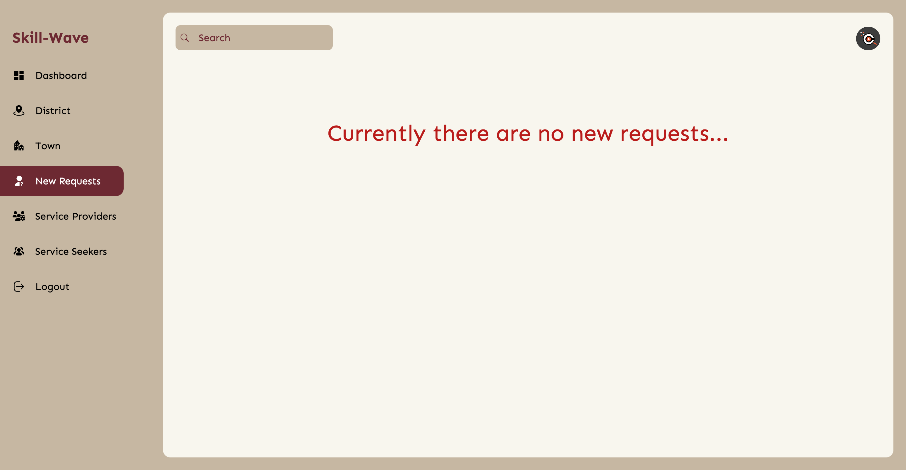

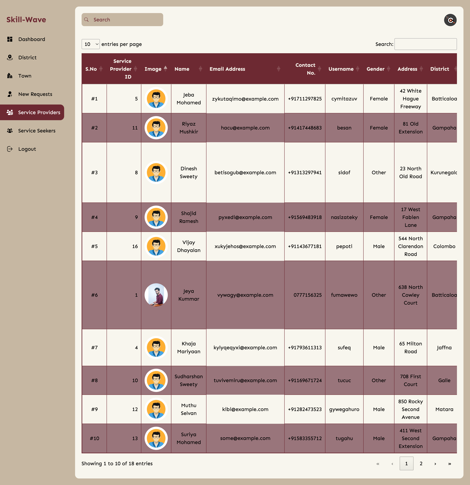

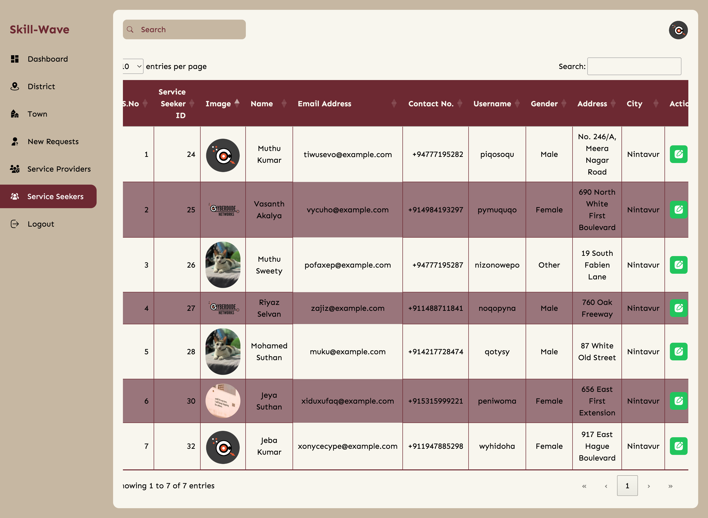

## How to run

- Clone the Repo into Local machine

```
git clone https://github.com/Mushkir/skill-wave-service-hiring-app.git
```

- Open the DB Folder

- Import the database file into phpmyadmin

- Run the server (XAMPP / WAMP)

- Copy the Project file into "htdocs" folder.

- Open the browser and type as `localhost/skill-wave-service-hiring-app/` and Press enter.

- Now you can explore the project.

### License: MIT (Do whatever, you want!)

### Author

- [Mohamed Mushkir](https://www.facebook.com/profile.php?id=100059556802890)
